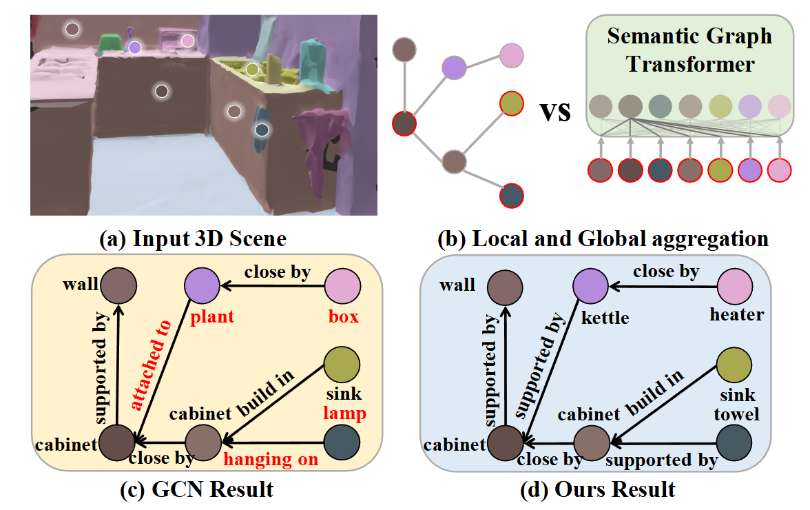
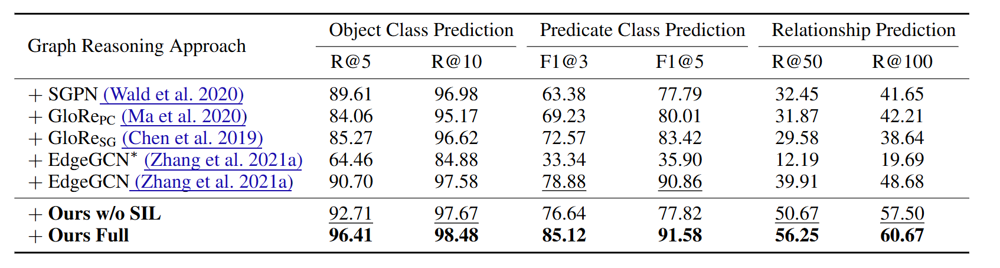

<div align="center" style="font-family: charter;">

<h1><i>SGFormer</i>:</br> Semantic Graph Transformer for Point Cloud-based 3D Scene Graph Generation</h1>


<br />

<a href="https://arxiv.org/abs/2303.11048" target="_blank">
    
</a>
<a href="https://github.com/chaoyivision/SGGpoint" target="_blank">
    
</a>

<div>
    <a href="https://scholar.google.com/citations?user=iFz5h28AAAAJ&hl=zh-CN" target="_blank">Changsheng Lv</a><sup>1</sup>,
    <a href="https://jueduilingdu.github.io/" href="#">Mengshi Qi</a><sup>1</sup>,
    <a href="https://medapt.cn/">Xia Li</a><sup>1</sup>,
    <a href="https://zyang-ur.github.io/">Zhengyuan Yang</a><sup>2</sup>,
    <a href="https://teacher.bupt.edu.cn/mahuadong/en/index.htm" target="_blank">Huadong Ma</a><sup>1</sup>
</div>

<div>
    <sup>1</sup> Beijing University of Posts and Telecommunications &emsp;
    <sup>2</sup> University of Rochester &emsp;
</div>


<p align="justify"><i>3D scene graph generation aims to parse a 3D scene into a structured graph of objects and their relationships. While recent methods leverage point clouds as input, they often overlook semantic richness and struggle to model long-range relational dependencies. To bridge this gap, we propose SGFormer — a novel Semantic Graph Transformer that injects enriched textual semantics (e.g., LLM-enhanced object descriptions) into a dual-layer architecture: a Graph Embedding Layer for structural reasoning and a Semantic Injection Layer for knowledge-aware message passing. SGFormer achieves state-of-the-art performance on the 3DSSG-O27R16 benchmark.</i></p>

</div>

## Release
- `2024-02-15` 🚀 SGFormer paper accepted by AAAI 2024!
- `2024-01-10` 💾 Code and model release for SGFormer!

## Contents

- [Release](#release)
- [Contents](#contents)
- [3DSSG-O27R16 Dataset](#3dssg-o27r16-dataset)
- [Results](#results)
- [Run Your Own Evaluation](#run-your-own-evaluation)
  - [Dataset](#dataset)
  - [Installation](#installation)
  - [Evaluation](#evaluation)
- [Acknowledgement](#acknowledgement)
- [Citation](#citation)

## 3DSSG-O27R16 Dataset

**Overview:** We adopt the cleaned **3DSSG-O27R16** dataset introduced by [SGGpoint (CVPR 2021)](https://github.com/chaoyivision/SGGpoint), which enhances the original 3DSSG with:
- Dense 10-dim point clouds (XYZ + RGB + normal + instance ID)
- Full-scene graphs (not subgraphs)
- 27 object classes (O27) and 16 structural relationship types (R16)
- Removal of low-quality scans and comparative relations (e.g., `more-comfortable-than`)
- Multi-class edge labeling (instead of multi-label)

> 🔍 For dataset download and preprocessing details, please visit the [SGGpoint dataset page](https://sggpoint.github.io/#dataset).


## Results

**Evaluation Setup:** We evaluate SGFormer on the **3DSSG-O27R16** validation set using standard scene-graph metrics: **Recall@50** for node classification and **Mean Recall@50** for edge (relationship) prediction.





> ✨ SGFormer outperforms prior arts by a clear margin, especially in relationship understanding, thanks to its semantic-aware transformer design.

## Run Your Own Evaluation

### Dataset

Follow the instructions at [SGGpoint Dataset Guide](https://sggpoint.github.io/#dataset) to obtain **3DSSG-O27R16**. Place the data under `data/3DSSG/`.

### Installation

```bash
conda create --name sgformer python=3.8
conda activate sgformer

git clone https://github.com/yourname/SGFormer.git
cd SGFormer

pip install -r requirements.txt

```
### Training
```bash
CUDA_VISIBLE_DEVICES=5 python -m main --mode train --config /home/lcs/tpami2025/config/SGFormer.json --exp exp_76_test \
        --model_name Mmgnet --continue_learning_mode none --root /home/lcs/tpami2025/data/3DSSG_subset \
        --dataset_annotation_type 160O26R \
        --obj_label_path /home/lcs/tpami2025/data/3DSSG_subset/classes.txt \
        --rel_label_path /home/lcs/tpami2025/data/3DSSG_subset/relationships.txt \
        --num_workers 8 --task_type PredCls
```
### Inference
```bash
CUDA_VISIBLE_DEVICES=3 python inference.py --config /home/lcs/tpami2025/config/SGFormer.json --exp exp_66 \
--model_name SGFormer --CKPT_PATH /data_3/lcs/tpami2025/workdir --num_workers 8 --root /home/lcs/tpami2025/data/3DSSG_subset --inference_num 67 \
--obj_label_path /home/lcs/tpami2025/data/3DSSG_subset/classes.txt --rel_label_path /home/lcs/tpami2025/data/3DSSG_subset/relationships.txt \
--use_VLM_description --use_triplet --dataset_annotation_type 160O26R 
```

## Acknowledgement

Our evaluation code is build upon [VL-SAT](https://github.com/wz7in/CVPR2023-VLSAT). We acknowledge their team for providing this excellent toolkit for evaluating multimodal large language models.

## Citation

If you find our paper and code useful in your research, please consider giving us a star :star: and citing our work :pencil: :)
```
@inproceedings{lv2024sgformer,
  title={SGFormer: Semantic Graph Transformer for Point Cloud-Based 3D Scene Graph Generation},
  author={Lv, Changsheng and Qi, Mengshi and Li, Xia and Yang, Zhengyuan and Ma, Huadong},
  booktitle={Proceedings of the AAAI Conference on Artificial Intelligence},
  volume={38},
  number={5},
  pages={4035--4043},
  year={2024}
}
```
