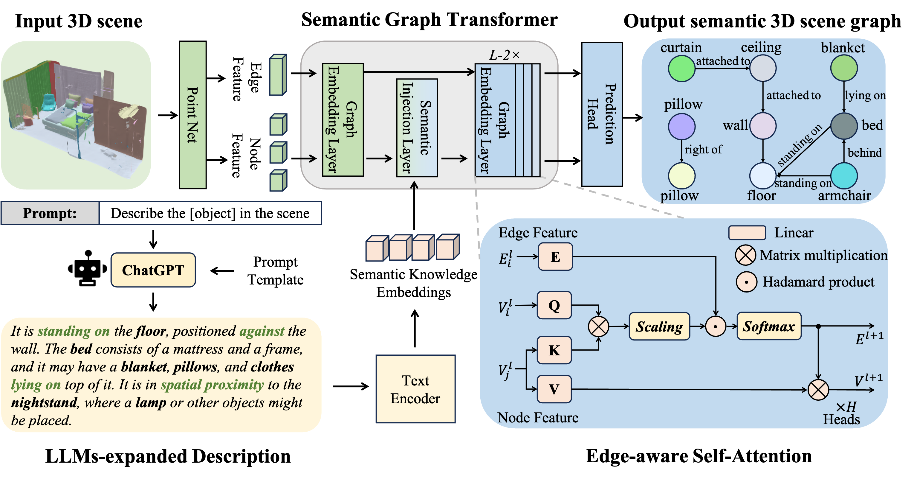

# SGFormer

Official implementation of "SGFormer: Semantic Graph Transformer for Point Cloud-based 3D Scene Graph Generation", AAAI 2024

[[Paper]](https://arxiv.org/pdf/2303.11048) 



Figure, Overview pipeline of our proposed SGFormer. We leverage PointNet to initialize the node and edge features in the 3D scene and use LLMs ( i.e., ChatGPT) to enrich the object description text of the dataset as semantic knowledge. The SGFormer main consists of two carefully designed components: a Graph Embedding Layer and a Semantic Injection Layer.

## Dataset
We followed the dataset processing method of [EdgeGCN](https://github.com/chaoyivision/SGGpoint)
A quick glance at some features of our cleaned <b>3DSSG-<font color="red">O27</font><font color="blue">R16</font></b> dataset (compared to the original 3DSSG dataset):
* dense point cloud representation with color and normal vector info. encoded - see [Sec. A - Point Cloud Sampling](https://chaoyivision.github.io/SGGpoint/#a-point-cloud-sampling);
* with same scene-level split applied on 3DSSG - but with <i>FullScenes (i.e., original graphs)</i> instead of SubScenes (subgraphs of 4-9 nodes in 3DSSG);
* with small / partial scenes of low quality excluded - see this [list](http://campar.in.tum.de/files/3RScan/partial.txt) (officially announced in 3DSSG's [FAQ Page](https://github.com/WaldJohannaU/3RScan/blob/master/FAQ.md#some-scenes-in-3rscan-seem-to-be-quite-small--partial-whys-that));
* with object-level class imbalance alleviated - see [Sec. B1 - Node (object) Remapping](https://chaoyivision.github.io/SGGpoint/#b-updates-on-scene-graph-annotations);
* with edge-wise comparative relationships (e.g., `more-comfortable-than`) filtered out - we focus on <i>structural relationships</i> instead;
* reformulate the edge predictions from a multi-label classification problem to a multi-class one - see [Sec. B2 - Edge (Relationship) Relabelling](https://chaoyivision.github.io/SGGpoint/#b-updates-on-scene-graph-annotations);

To obtain the <b>3DSSG-<font color="red">O27</font><font color="blue">R16</font></b> dataset, please follow the [instructions](https://sggpoint.github.io/#dataset) in EdgeGCN's project page.
## Code 

- [x] SGFormer.py: CoreNetwork of SGformer.

## Acknowledgement 
This resipotry is based on [EdgeGCN](https://github.com/chaoyivision/SGGpoint)
## Citation

If you find our data or project useful in your research, please cite:

```
@inproceedings{lv2024sgformer,
  title={SGFormer: Semantic Graph Transformer for Point Cloud-Based 3D Scene Graph Generation},
  author={Lv, Changsheng and Qi, Mengshi and Li, Xia and Yang, Zhengyuan and Ma, Huadong},
  booktitle={Proceedings of the AAAI Conference on Artificial Intelligence},
  volume={38},
  number={5},
  pages={4035--4043},
  year={2024}
}
```

